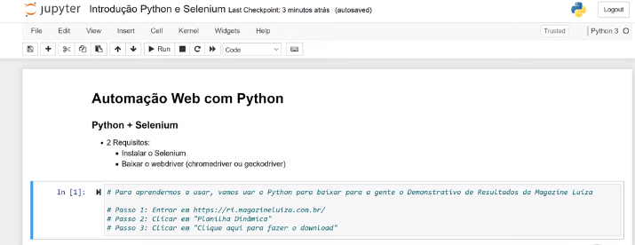
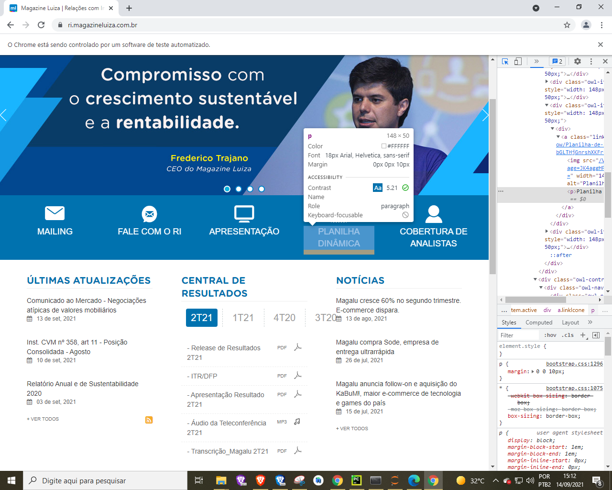
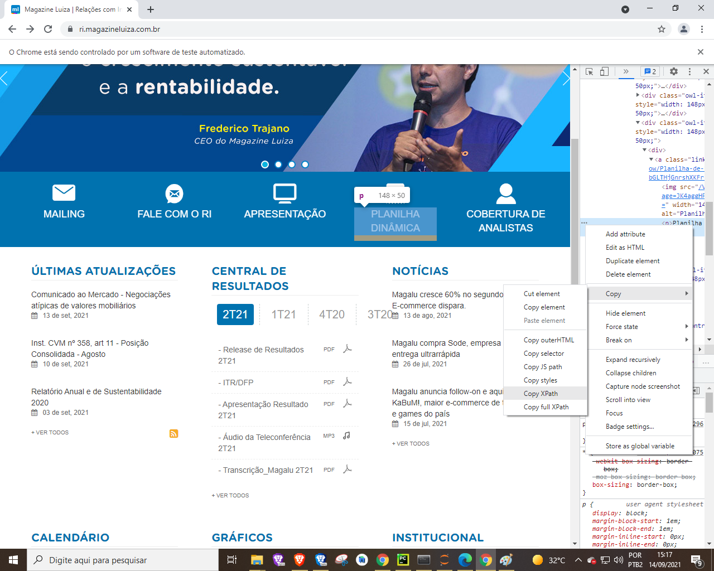
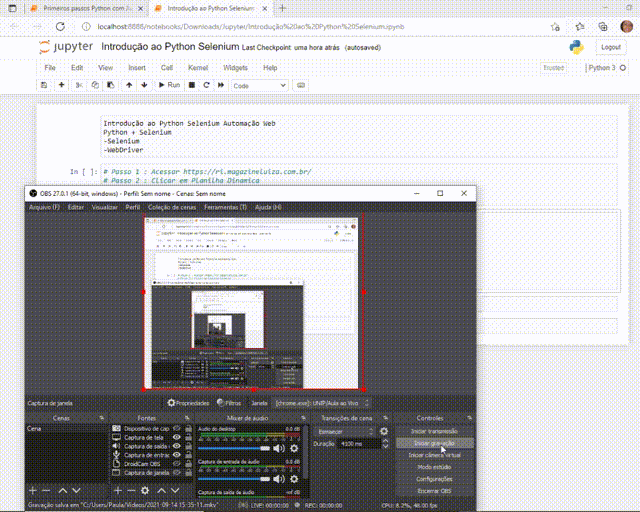

# Automação Web com Python + Selenium

Objetivo entrar no site da maquagine luiza e 

ri.magazineluiza.com.br

pyautogui

[Jupyter e Anaconda](img/Jupyter.md)

[Instalando o Selenium](img/Selenium.md)

[Baixando o WebDriver](img/WebDriver.md)

# Importando Selenium

from selenium import webdriver // Da biblioteca selenium import Webdriver

navegador = webdriver.Chrome() // Abrir navegador  ou Firefox

Clik em Run

Abrira o navegador Chrome

### Abrindo o Site  ri.magazineluiza.com.br

navegador.get("[https://ri.magazineluiza.com.br/](https://ri.magazineluiza.com.br/)")

# Localizando um elemento na pagina

navegador.find_element_by_xpath()

Selenium Python

Inspecionar elemento selecionar icone com seta e copiar o xpath

//*[@id="owl-destaques"]/div[1]/div/div[4]/div/a/p

navegador.find_element_by_xpath('//*[@id="owl-destaques"]/div[1]/div/div[4]/div/a/p')

Clique aqui para fazer o download

Xpath = //*[@id="bWtQ7n6RcQdDDDCgCcH3yg=="]

from selenium import webdriver

navegador = webdriver.Chrome()

navegador.get("[https://ri.magazineluiza.com.br/](https://ri.magazineluiza.com.br/)")
navegador.find_element_by_xpath('//*[@id="owl-destaques"]/div[1]/div/div[4]/div/a/p').click()
navegador.find_element_by_xpath('//*[@id="bWtQ7n6RcQdDDDCgCcH3yg=="]').click()

## 

# Sucesso 🤩
