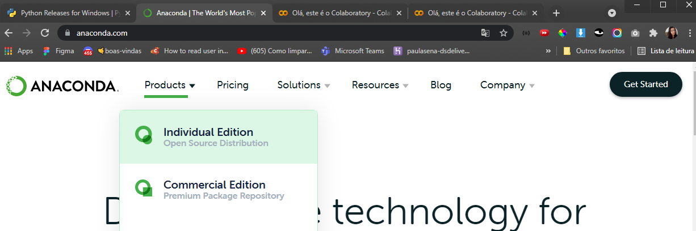
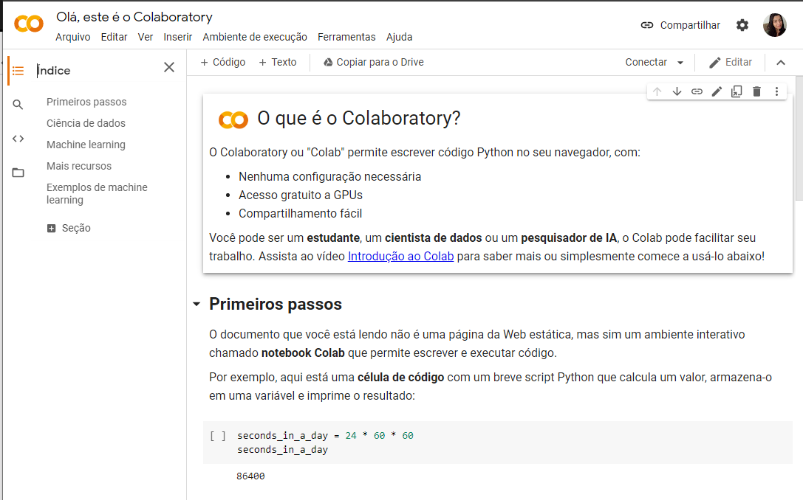
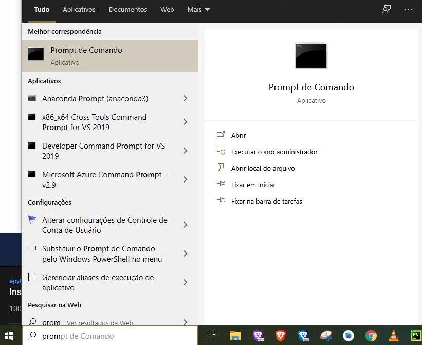
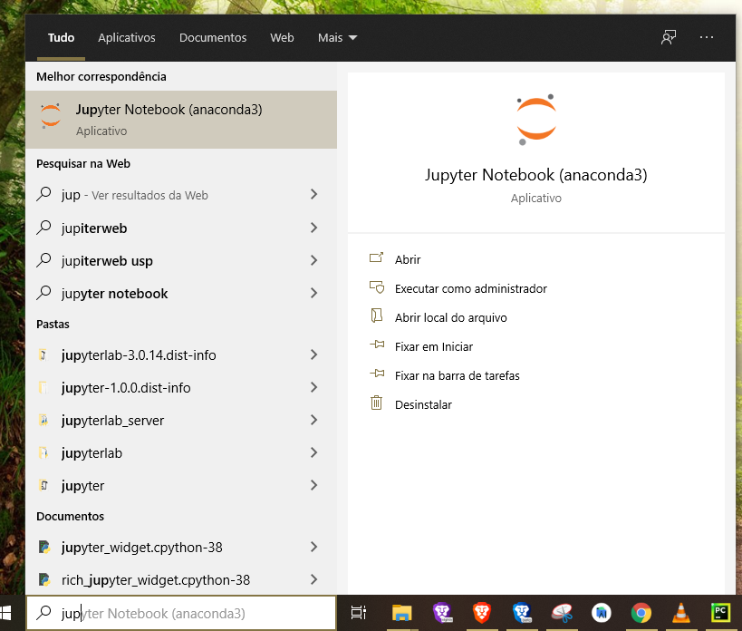
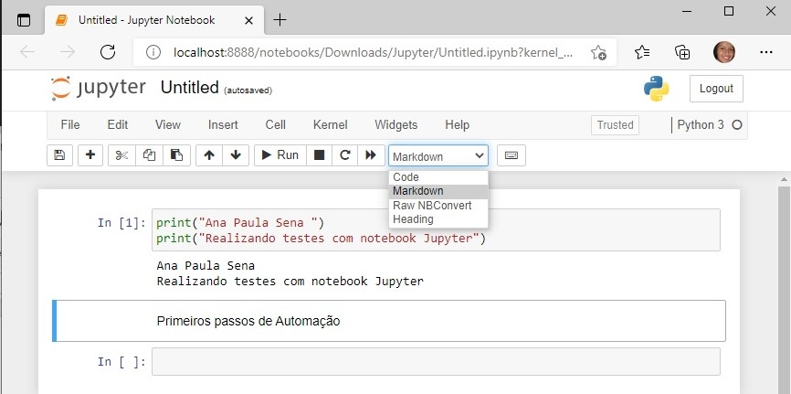

# Jupyter e Anaconda

Instalando o Jupyter - Pacote Anaconda para Programação em Python

# Google colab

Alternativa do Jupyter

integrado com o google drive

[https://colab.research.google.com/notebooks/welcome.ipynb?hl=pt-BR&authuser=1](https://colab.research.google.com/notebooks/welcome.ipynb?hl=pt-BR&authuser=1)

se erro instalar o outro

# Prompt Anaconda

# Jupyter

[http://localhost:8888/tree](http://localhost:8888/tree)

Não Fechar o Jupyter 

## Criar uma nova pasta atraves do Jupyter

# Criando um notebook

## Realizando um Print

Celulas de Codgo e Celulas de Texto

## Markdown

### Pasta Download

# Sucesso 😀