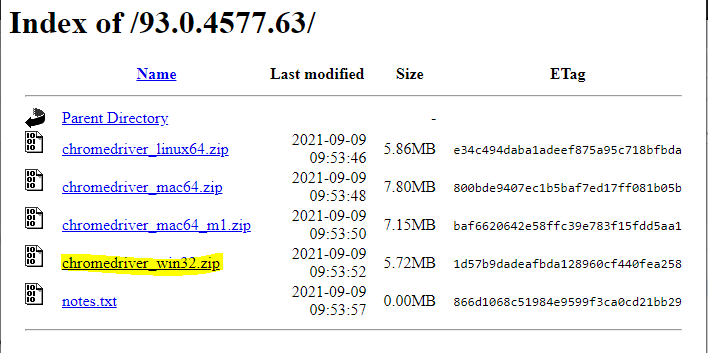

# Baixando o WebDriver

## Chromedrive ou geckodriver

[https://chromedriver.chromium.org/home](https://chromedriver.chromium.org/home)

[https://chromedriver.storage.googleapis.com/index.html?path=93.0.4577.63/](https://chromedriver.storage.googleapis.com/index.html?path=93.0.4577.63/) 

No disco C: → Usuarios → Paula → Pasta anaconda3 

colar o arquivo executavel do chromedriver onde esta localizado o python no pc

